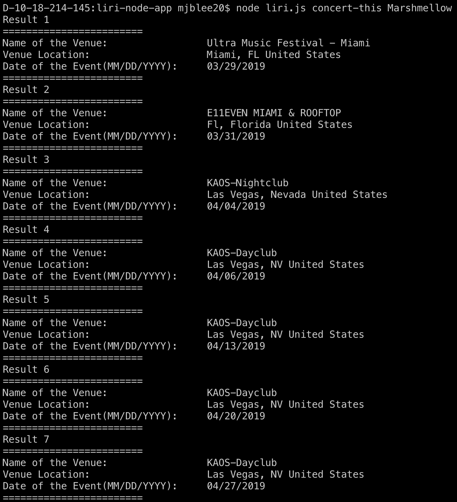
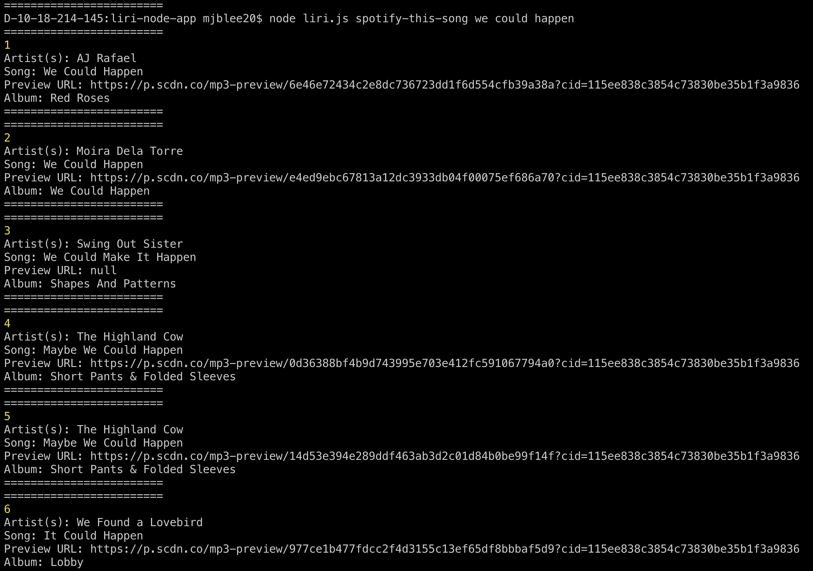
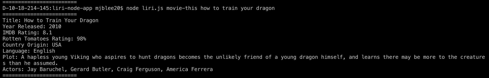
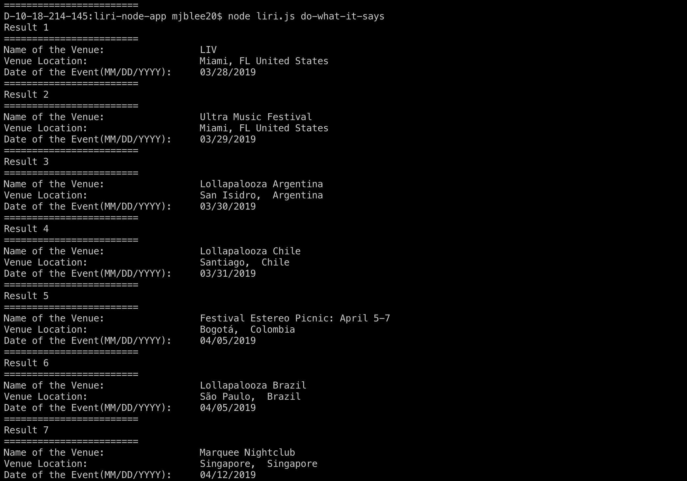

# LIRI-NODE-APP

## Function

This node app allows for a few functions: 
    * Search the name of an artist and see when and where he or she is hosting concerts, as well as the name of the venue.
    
    * Search a song name to pull up a list of songs utilizing the Spotify API
    
    * Search a movie title to get specific details of the movie. (i.e. title, year released, rating, language, and plot)
    
    * Search for anything of the above by entering text in random.txt in certain formats
    
    * All search results will be logged in the filed named log.txt

---

## How to Use the App

#### 1. Clone the repository on to your computer. 

#### 2. Open up the command line
    - install the npm packages mentioned below
        * initialize package.json
        
            npm init -y

        * install the npm packages that the app depends on

            npm i

    - In the command line this app has 4 commands.

        * node liri.js concert-this &lt;artists's name&gt;

        * node liri.js spotify-this-song &lt;artists's name&gt;

        * node liri.js movie-this &lt;artists's name&gt;

        * node liri.js do-what-it-says &lt;artists's name&gt;
        
            * do-what-it-says function depends on the text within random.txt
                - Currently in random.txt, I have ... concert-this, tiesto ...
#### 3. All search results will be in text form in the file log.txt

---

## npm Packages

    * axios
        For the API request calls and handling of the response data
    * node-spotify-api
        For spotify API requests and handling of the response data
    * moment.js
        For converting the date in bandsintown API
    * dotenv
        For preventing sensitive data to be visible to public

